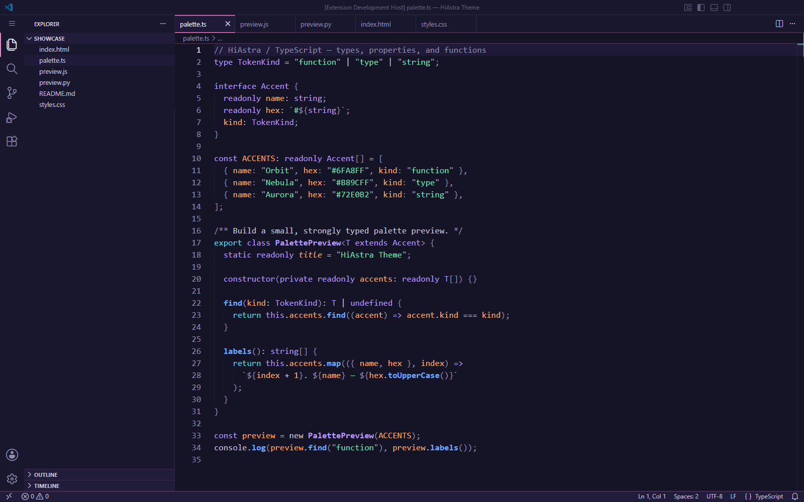
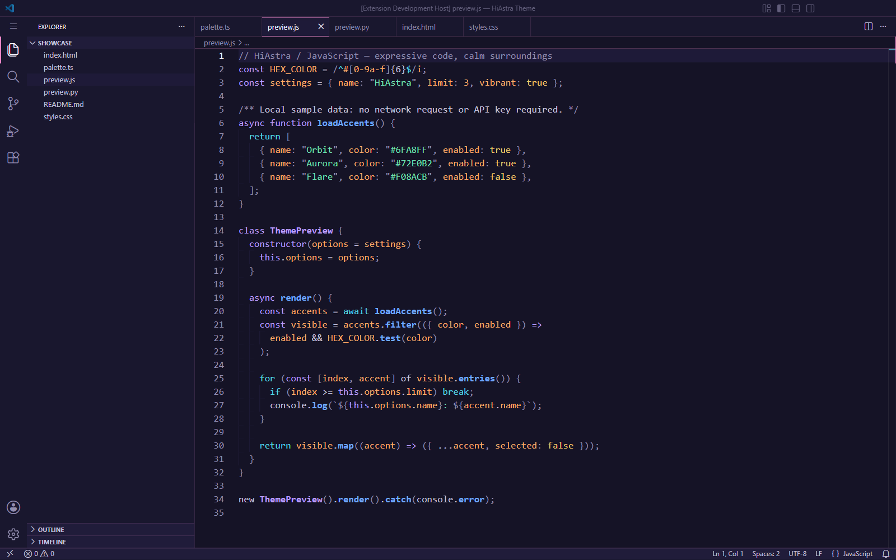
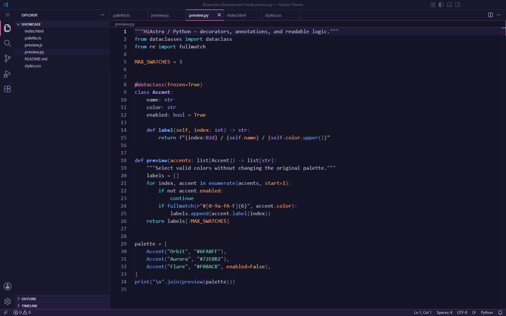
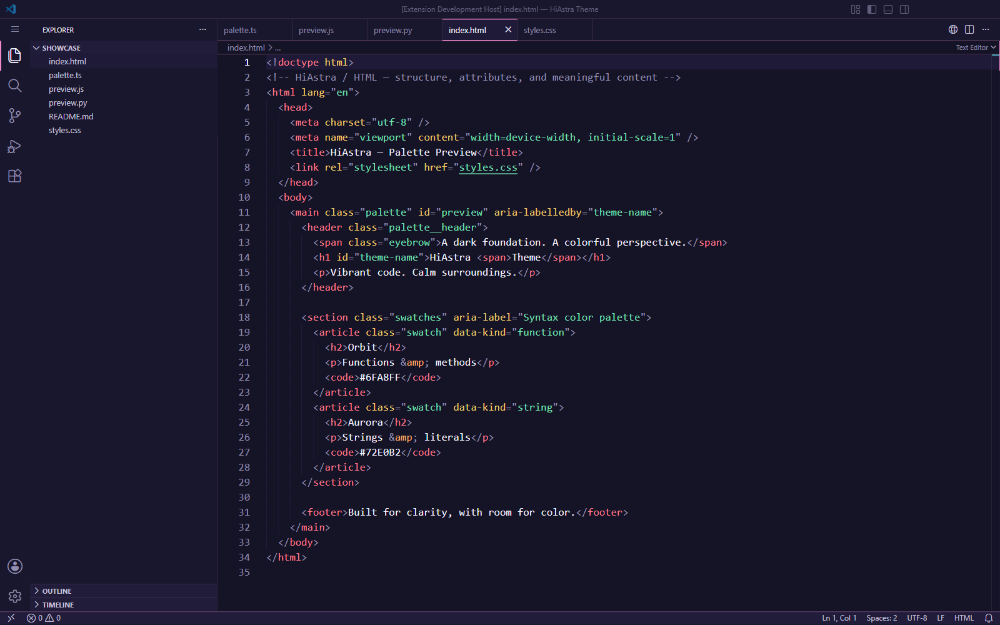
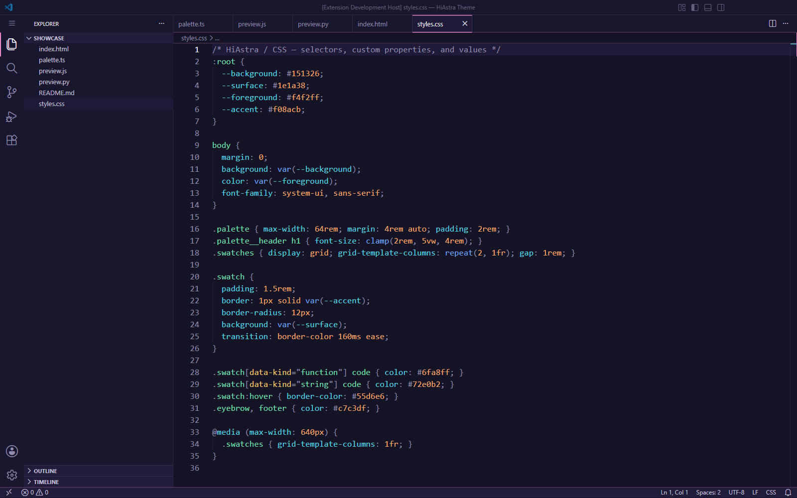

# HiAstra Theme

**Vibrant code. Calm surroundings.**

HiAstra is a dark VS Code theme that pairs a deep violet foundation with vibrant syntax colors and a restrained interface. It emphasizes visual clarity and is designed with comfortable long-session use in mind: expressive code, readable comments, and clear focus states without an overwhelming neon palette.

## Visual characteristics

- **Deep, layered surfaces:** dark violet backgrounds distinguish the editor, sidebar, and panels without relying on pure black.
- **Purposeful syntax colors:** blue functions, purple types, mint strings, and warm accents for properties and values.
- **Readable supporting details:** comments and punctuation remain visible while letting the code take priority.
- **Clear navigation:** active tabs, selections, and focused controls stand out against quieter inactive surfaces.
- **Coordinated highlighting:** TextMate and semantic styles share the same color families.

## Installation

Requires VS Code **1.136.0 or newer within the 1.x series**, matching the current extension manifest.

### From the Marketplace

These instructions apply once the extension is published.

1. Open the **Extensions** view in VS Code.
2. Search for **HiAstra Theme** with the extension ID `hi-soft-tech.hiastra-theme`.
3. Select **Install**.
4. Open the Command Palette, run **Preferences: Color Theme**, and select **HiAstra Theme**.

[View on the Marketplace](https://marketplace.visualstudio.com/items?itemName=hi-soft-tech.hiastra-theme)

### From a local VSIX

1. Obtain a packaged HiAstra `.vsix` file from a source you trust.
2. Open the Command Palette and run **Extensions: Install from VSIX...**.
3. Select the file and reload VS Code if prompted.
4. Run **Preferences: Color Theme** and select **HiAstra Theme**.

Alternatively, if the `code` command is available in your terminal:

```sh
code --install-extension "path/to/hiastra-theme-0.1.0.vsix"
```

Replace the example path and version with your actual file. See VS Code's [installation guide](https://code.visualstudio.com/docs/configure/extensions/extension-marketplace#install-from-a-vsix) and [theme selection guide](https://code.visualstudio.com/docs/configure/themes).

## Settings

No special font, icon pack, or settings bundle is required. Choose your font size and line spacing for your own display and preferences.

HiAstra enables semantic highlighting through the theme. If you previously disabled it, restore the following setting to let the active theme decide:

```json
{
  "editor.semanticHighlighting.enabled": "configuredByTheme"
}
```

Language extensions supply semantic information, so the available highlighting can vary by language and project. Existing color customizations can also override the theme.

## Language coverage

HiAstra includes language-specific TextMate styling and test fixtures for:

- JavaScript and TypeScript
- React JSX and TSX
- HTML and CSS
- JSON and Python
- Markdown and Bash/shell scripts

The regression suite checks 55 color/style cases across these ten fixtures using the development installation's bundled VS Code grammars. This verifies TextMate output, not every language extension or semantic provider. Other languages receive the theme's shared scope styles, but have not received the same focused testing.

See the [visual test fixtures in the repository](https://github.com/REPLACE_WITH_GITHUB_OWNER/REPLACE_WITH_REPOSITORY_NAME/tree/HEAD/theme-tests) for what to inspect; development fixtures are not included in the VSIX. Markdown styling refers to the source editor, not the rendered preview. HiAstra supplies colors, not language servers or diagnostics.

## Screenshots

Captured in VS Code's Extension Development Host using the current HiAstra theme.
These are real editor screenshots, not mockups or color-enhanced images. The
capture profile uses Consolas at 17 px, 24 px line height, no file-icon theme,
and no minimap or color-decorator swatches. Semantic highlighting is configured
by the theme; Python uses the built-in TextMate grammar without a Python language server.

### TypeScript

Interfaces, generics, readonly properties, and methods against the dark workbench.



### JavaScript

Async functions, classes, object properties, regular expressions, and template strings.



### Python

Dataclasses, decorators, annotations, f-strings, and control flow.



### HTML

Semantic structure, coral tags, gold attributes, entities, and mint attribute values.



### CSS

Mint selectors, cyan custom properties, warm values and units, and media queries.



## Feedback and issues

Found a hard-to-read token or an inconsistent UI color? [Open an issue](https://github.com/REPLACE_WITH_GITHUB_OWNER/REPLACE_WITH_REPOSITORY_NAME/issues) with:

- Your VS Code and HiAstra versions, operating system, and relevant language extensions.
- A small code example and its language mode.
- A screenshot, with private information removed.
- The expected appearance and what you see instead.
- Whether semantic highlighting or custom color overrides are enabled.

For syntax issues, **Developer: Inspect Editor Tokens and Scopes** can help identify the affected scope or semantic token. Include those details when available.

## Contributing

Focused improvements to scope coverage, readability, documentation, and test fixtures are welcome. Start in the [repository](https://github.com/REPLACE_WITH_GITHUB_OWNER/REPLACE_WITH_REPOSITORY_NAME); discuss larger palette changes in an issue first.

For theme changes, preserve the existing color families, add or update a small fixture, and compare semantic highlighting both on and off in the Extension Development Host. Include before-and-after screenshots in your pull request.

## License

**Release license: REPLACE_WITH_CHOSEN_LICENSE.**

The manifest currently uses `UNLICENSED`; an open-source license has not yet been selected. Before release, replace this section with the chosen license and a link to the corresponding license file, and update `package.json` to match.
